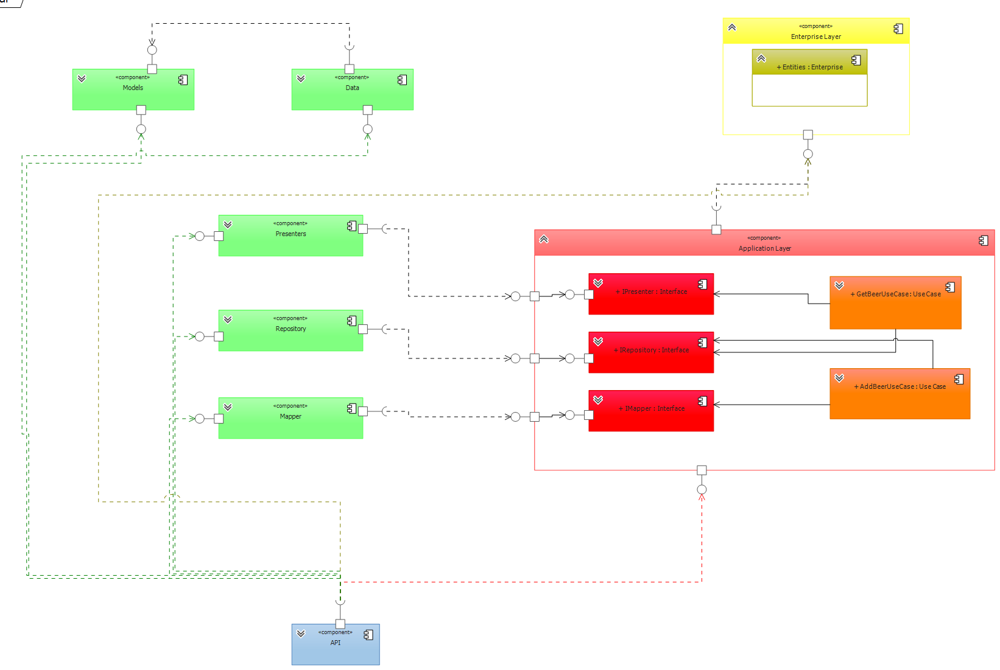

# Curso de Clean Architecture en C# .Net

Curso de Udemy para aprender los conceptos fundamentales de la Arquitectura de Software impartido por Hertor de Leon.

[Enlace al curso en Udemy](https://www.udemy.com/course/clean-architecture-course/learn/lecture/43406848#overview)

## Contenido

### Sección 1. Introducción
1. [Introducción](https://www.udemy.com/course/clean-architecture-course/learn/lecture/43406832#overview)
2. [¿Que es una Arquitectura de sofware?](https://www.udemy.com/course/clean-architecture-course/learn/lecture/43407244#overview)
3. [¿Que es Clean Architecture?](https://www.udemy.com/course/clean-architecture-course/learn/lecture/43407250#overview)
4. [¿Que es C# y .Net?](https://www.udemy.com/course/clean-architecture-course/learn/lecture/43407360#overview)

### Sección 2. Paradigma de Programación Estructurado

5. [¿Qué son los paradigmas de programación](https://www.udemy.com/course/clean-architecture-course/learn/lecture/43646342#overview)
6. [Paradigma Estructurado](https://www.udemy.com/course/clean-architecture-course/learn/lecture/43407290#overview)
7. [Creación de un Proyecto en .NET](https://www.udemy.com/course/clean-architecture-course/learn/lecture/43406888#overview)
8. [Variables](https://www.udemy.com/course/clean-architecture-course/learn/lecture/43406848#overview)
9. [Arrays](https://www.udemy.com/course/clean-architecture-course/learn/lecture/43407548#overview)
10. [Sentencias condicionales](https://www.udemy.com/course/clean-architecture-course/learn/lecture/43407296#overview)
11. [Sentencias de iteración](https://www.udemy.com/course/clean-architecture-course/learn/lecture/43407320#overview)
12. [Funciones](https://www.udemy.com/course/clean-architecture-course/learn/lecture/43407324#overview)
13. [Ejemplo de programa con paradigma estructurado](https://www.udemy.com/course/clean-architecture-course/learn/lecture/43407326#overview) - [Repo link](https://github.com/jlcastillog/learning/tree/main/CleanArchitecture.NET/CleanArchitecture/StructurePrograming)

### Sección 3. Paradigma de Programación orientada a objetos

14. [Paradigma Orientado a Objetos](https://www.udemy.com/course/clean-architecture-course/learn/lecture/43745254#overview)
15. [Clases y objetos](https://www.udemy.com/course/clean-architecture-course/learn/lecture/43745256#overview)
16. [Método Constructor](https://www.udemy.com/course/clean-architecture-course/learn/lecture/43745536#overview)
17. [Campos y propiedades](https://www.udemy.com/course/clean-architecture-course/learn/lecture/43745644#overview)
18. [Espacio de nombres (Namespace)](https://www.udemy.com/course/clean-architecture-course/learn/lecture/43757770#overview)
19. [Herencia](https://www.udemy.com/course/clean-architecture-course/learn/lecture/43745648#overview)
20. [Encapsulamiento](https://www.udemy.com/course/clean-architecture-course/learn/lecture/43745650#overview)
21. [Sobrecarga](https://www.udemy.com/course/clean-architecture-course/learn/lecture/43758152#overview)
22. [Sobreescritura](https://www.udemy.com/course/clean-architecture-course/learn/lecture/43758154#overview)
23. [Clases abstractas](https://www.udemy.com/course/clean-architecture-course/learn/lecture/43864524#overview)
24. [Polimorfismo con clases abstractas](https://www.udemy.com/course/clean-architecture-course/learn/lecture/43897094#overview)
25. [Interfaces](https://www.udemy.com/course/clean-architecture-course/learn/lecture/43758376#overview)
26. [Generics](https://www.udemy.com/course/clean-architecture-course/learn/lecture/43865968#overview)
27. [Static](https://www.udemy.com/course/clean-architecture-course/learn/lecture/43758378#overview)

[Repo Link](https://github.com/jlcastillog/learning/tree/main/CleanArchitecture.NET/CleanArchitecture/Object-OrientedProgramming)

### Sección 4: Paradigma Funcional

28. [Paradigma funcional](https://www.udemy.com/course/clean-architecture-course/learn/lecture/43959148#overview)
29. [Función pura](https://www.udemy.com/course/clean-architecture-course/learn/lecture/43959208#overview)
30. [Función primera clase](https://www.udemy.com/course/clean-architecture-course/learn/lecture/43959216#overview)
31. [Tipo Action](https://www.udemy.com/course/clean-architecture-course/learn/lecture/43971648#overview)
32. [Expresiones Lamda](https://www.udemy.com/course/clean-architecture-course/learn/lecture/43971650#overview)
33. [Tipo Func](https://www.udemy.com/course/clean-architecture-course/learn/lecture/43971652#overview)
34. [Función de orden superior](https://www.udemy.com/course/clean-architecture-course/learn/lecture/43959218#overview)
35. [Tipo Predicate](https://www.udemy.com/course/clean-architecture-course/learn/lecture/43971658#overview)

[Repo Link](https://github.com/jlcastillog/learning/tree/main/CleanArchitecture.NET/CleanArchitecture/FunctionalProgramming)

### Sección 5: Principios SOLID

36. [¿Qué son los principios SOLID?](https://www.udemy.com/course/clean-architecture-course/learn/lecture/45190877#overview)
37. [Principio de responsabilidad única (Single responsibility principle)](https://www.udemy.com/course/clean-architecture-course/learn/lecture/43973078#overview)
38. [Principio de abierto/cerrado (Open/closed principle)](https://www.udemy.com/course/clean-architecture-course/learn/lecture/43973080#overview)
39. [Principio de sustitución de Liskov (Liskov substitution principle)](https://www.udemy.com/course/clean-architecture-course/learn/lecture/43973088#overview)
40. [Principio de segregación de la interfaz (Interface segregation principle)](https://www.udemy.com/course/clean-architecture-course/learn/lecture/43973092#overview)
41. [Principio de inversión de la dependencia (Dependency inversion principle)](https://www.udemy.com/course/clean-architecture-course/learn/lecture/43973100#overview)

[Repo Link](https://github.com/jlcastillog/learning/tree/main/CleanArchitecture.NET/CleanArchitecture/SOLID)

### Sección 6: Componentes

42. [¿Qué es un componente?](https://www.udemy.com/course/clean-architecture-course/learn/lecture/44552931#overview)
43. [The Reuse-Release Equivalence Principle (REP)](https://www.udemy.com/course/clean-architecture-course/learn/lecture/44661201#overview)
44. [The Common Closure Principle (CCP)](https://www.udemy.com/course/clean-architecture-course/learn/lecture/44661217#overview)
45. [The Common Reuse Principle (CRP)](https://www.udemy.com/course/clean-architecture-course/learn/lecture/44661223#overview)
46. [The Acyclic Dependencies Principle (ADP)](https://www.udemy.com/course/clean-architecture-course/learn/lecture/44674049#overview)
47. [The Stable Dependencies Principle (SDP)](https://www.udemy.com/course/clean-architecture-course/learn/lecture/44674895#overview)
48. [The Stable Abstractions Principle (SAP)](https://www.udemy.com/course/clean-architecture-course/learn/lecture/44674903#overview)

### Section 7: Arquitectura de Software

49. [¿Qué es una Arquitectura de Software?](https://www.udemy.com/course/clean-architecture-course/learn/lecture/44785479#overview)
50. [¿Qué es y que hace un Arquitecto de Software?](https://www.udemy.com/course/clean-architecture-course/learn/lecture/44785485#overview)
51. [¿De qué están hechos los Sistemas?](https://www.udemy.com/course/clean-architecture-course/learn/lecture/44785813#overview)
52. [Comunicación entre componentes (explicación teórica)](https://www.udemy.com/course/clean-architecture-course/learn/lecture/45110433#overview)
53. [Comunicación entre componentes (explicación práctica con código)](https://www.udemy.com/course/clean-architecture-course/learn/lecture/45110917#overview)
54. [Inyección de Dependencias](https://www.udemy.com/course/clean-architecture-course/learn/lecture/45111193#overview)
55. [Componentes de alto nivel y bajo nivel](https://www.udemy.com/course/clean-architecture-course/learn/lecture/45123259#overview)
56. [¿Qué es una capa?](https://www.udemy.com/course/clean-architecture-course/learn/lecture/45124379#overview)

### Sección 8: Clean Architecture

57. [¿Qué es Clean Architecture?](https://www.udemy.com/course/clean-architecture-course/learn/lecture/45124963#overview)
58. [La Regla de Dependencia](https://www.udemy.com/course/clean-architecture-course/learn/lecture/45134543#overview)
59. [Aclaraciones sobre Clean Architecture](https://www.udemy.com/course/clean-architecture-course/learn/lecture/45157241#overview)
60. [Entities (Capa Enterprise Business Rules)](https://www.udemy.com/course/clean-architecture-course/learn/lecture/45141535#overview)
61. [Use Cases (Capa Application Business Rules)](https://www.udemy.com/course/clean-architecture-course/learn/lecture/45141539#overview)
62. [Capa Interface Adapters](https://www.udemy.com/course/clean-architecture-course/learn/lecture/45141545#overview)
63. [Entity Framework (Capa Interface Adapters)](https://www.udemy.com/course/clean-architecture-course/learn/lecture/45162101#overview)
64. [Repository (Capa Interface Adapters)](https://www.udemy.com/course/clean-architecture-course/learn/lecture/45162107#overview)
65. [Capa Frameworks y Drivers](https://www.udemy.com/course/clean-architecture-course/learn/lecture/45141551#overview)
66. [Creación de Base de Datos (Capa Frameworks y Drivers)](https://www.udemy.com/course/clean-architecture-course/learn/lecture/45162119#overview)
67. [Creación de API (Capa Frameworks y Drivers)](https://www.udemy.com/course/clean-architecture-course/learn/lecture/45162117#overview)
68. [Inyección de Dependencias en API (Capa Frameworks y Drivers)](https://www.udemy.com/course/clean-architecture-course/learn/lecture/45162123#overview)
69. [Models](https://www.udemy.com/course/clean-architecture-course/learn/lecture/45238927#overview)
70. [Creación del Componente Models (Capa Interface Adapters)](https://www.udemy.com/course/clean-architecture-course/learn/lecture/45239149#overview)
71. [Uso de Generics en Interfaces](https://www.udemy.com/course/clean-architecture-course/learn/lecture/45239425#overview)
72. [¿Regresar Models o Entites en el componente Repository?](https://www.udemy.com/course/clean-architecture-course/learn/lecture/45240451#overview)
73. [Presenters](https://www.udemy.com/course/clean-architecture-course/learn/lecture/45270029#overview)
74. [Creación de interfaz IPresenter](https://www.udemy.com/course/clean-architecture-course/learn/lecture/45270645#overview)
75. [Creación de Presenter y ViewModel (Capa Interface Adapters)](https://www.udemy.com/course/clean-architecture-course/learn/lecture/45270945#overview)
76. [Mappers y DTOs](https://www.udemy.com/course/clean-architecture-course/learn/lecture/45271419#overview)
77. [Creación del componente Mapper (Capa Interface Adapters)](https://www.udemy.com/course/clean-architecture-course/learn/lecture/45293411#overview)
78. [Uso del Mapper y el DTO en el API (Capa Frameworks y Drivers)](https://www.udemy.com/course/clean-architecture-course/learn/lecture/45293637#overview)
79. [Análisis de las Capas y Componentes Utilizados.](https://www.udemy.com/course/clean-architecture-course/learn/lecture/45357469#overview)

