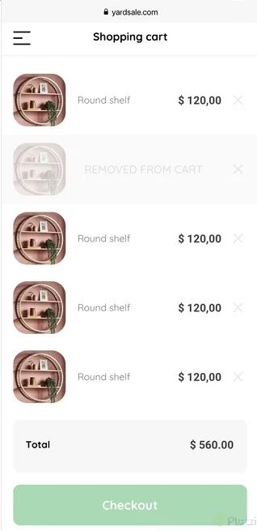

# yardsale.com

Proyecto práctico para poner en practica los conocimientos adquiridos en el curso de Html y CSS. Cnosistira en la creación de una web a partir de un boceto hecho por el equipo de UX/UI.

El área de diseño nos proporcionó el boceto del proyecto en [Figma](https://scene.zeplin.io/project/60afeeed20af1378ed046538).

Podemos identificar las vistas de:

- Inicio
- Creación de cuenta
- Acceso
- Carrito de compras
- Orden de compra
- Detalle de producto
- Menú

Desde aquí puedes ver cómo es la interacción entre las diferentes pantallas.

- [Dektop version](https://www.figma.com/proto/bcEVujIzJj5PNIWwF9pP2w/Platzi_YardSale?node-id=0-999&amp%3Bscaling=scale-down&amp%3Bpage-id=0%3A998&amp%3Bstarting-point-node-id=5%3A2808)
- [Mobile version](https://www.figma.com/proto/bcEVujIzJj5PNIWwF9pP2w/Platzi_YardSale?node-id=0-462&amp!%5Bshopping-cart.jpg%5D(https%3A%2F%2Fstatic.platzi.com%2Fmedia%2Fuser_upload%2Fshopping-cart-4d77fd41-9393-4883-b66b-2ee40682f1ea.jpg)%2F%2Fplatzi.com%2Fcategorias%2Fdiseno%2F=)