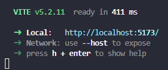

<h1>Curso de REACT </h1>

Curso del framework de React.js basado en el canal de youtube de midulive:

[Lista videos del curso de React 2024 - midulive](https://www.youtube.com/playlist?list=PLUofhDIg_38q4D0xNWp7FEHOTcZhjWJ29)

En caso de neceistar consultar documentacion puedes consultar estos enlaces:

- https://es.react.dev/reference/react
- https://www.reactjs.wiki/

## Comenzar proyecto

Para la gestion de paquetes vamos a usar "npm", asique para inicializar un proyecto usamos el comando:

> npm init -y

Ahora para crear el proyecto usaremos [Vite](https://vitejs.dev/) con el comando:

> npm create vite@latest

Pasos:
- Introducir nombre del poyecto
- Tipo de soporte (en nuestro caso seleccionamos React)
- Lenguaje (nosotros usaremos Javascript + *[SWC](https://swc.rs/))

*SWC -> Transpilador

Ultimo pase seria instalar las depencias del proyecto. Para ello, ubicado desde la terminal en la carpeta del proyecto se usa el comando:

>npm install

Para inicializar nuestro proyecto debes de usar:

>npm run dev

Aparecera algo asi:

