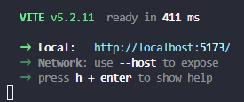
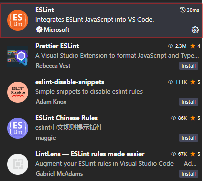
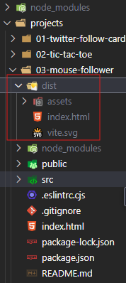

## Comenzar proyecto

Para la gestion de paquetes vamos a usar "npm", asique para inicializar un proyecto usamos el comando:

> npm init -y

Ahora para crear el proyecto usaremos [Vite](https://vitejs.dev/) con el comando:

> npm create vite@latest

Pasos:
- Introducir nombre del poyecto
- Tipo de soporte (en nuestro caso seleccionamos React)
- Lenguaje (nosotros usaremos Javascript + *[SWC](https://swc.rs/))

*SWC -> Transpilador

Ultimo pase seria instalar las depencias del proyecto. Para ello, ubicado desde la terminal en la carpeta del proyecto se usa el comando:

>npm install

Para inicializar nuestro proyecto debes de usar:

>npm run dev

Aparecera algo asi:

## Configurar linter para monorepo

Instalar el paquete en el proyecto

>npm install standard -D

Instalar el pluggin de Visual Code "ESLint"

## React Developer Tools

En Google Chrome puedes instalar la extesion:

## Desplegar en producción

Desde la terminal ejecutar:

> npm run build

Esto te genera el paquete para desplegar:

Puede usar esta pagina para desplegar tu web: [Netlify Drop](https://app.netlify.com/drop)

Para ello solo tienes que arrastar la carpeta del depliegue ("dist") en la zona indicada de la web.

## Como crear un proyecto react sin usar la template de vite

1. Crea el proyecto:

> npm create vite@latest

2. Seleccionar vanilla para que no te cree la planitlla y tengas que hacer tu manualmente

3. Seleccionar lenguaje (javascript)

4. Situarte en al carpeta del proyecto e instalar el siguiente pluging de vite:

> npm install @vitejs/plugin-react -E

5. Instalar dependencias

> npm install react react-dom -E

6. Añadir configuración de vite:

	1. Crear fichero vite.config.js en la raiz del proeycto
	2. Añadir este contenido:
	
>import { defineConfig } from 'vite'
import react from '@vitejs/plugin-react'
export default defineConfig({
  plugins: [react()]
})	

Puedes encontrar la inforamción de este fichero en la siguiente url: https://vitejs.dev/config/

7. Instalar linter:

> npm install standard -D

Añadir esta configuración en el archivo package.json

>"eslintConfig": {
    "extends": "./node_modules/standard/eslintrc.json" 
  }

## Crear un test End-To-End con Playwright

Para crear unos test con [Playwright](https://playwright.dev/docs/api/class-playwright):

1. Instalar el paquete en el proyecto:

> npm init playwright@lastest

Puede seleccionar de momento las opciones por defecto que te solicita.

2. Hay que cambiar la extension del fichero playwright.config.js a .cjs
3. En el archivo del test (example.spec.js) cambiar el require por un import
4. Crear tus test
5. Ejecutar las pruebas:

> npx playwright test
